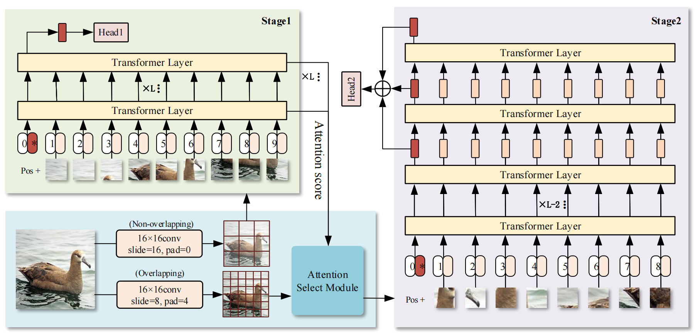

# An Attention-Locating Algorithm for Eliminates Background Effects in Fine-grained Visual Classification


## Dependencies:
+ Python 3.7.3
+ PyTorch 1.5.1
+ torchvision 0.6.1
+ ml_collections

## Usage
### 1. Download Google pre-trained ViT models

* [Get models in this link](https://console.cloud.google.com/storage/vit_models/): ViT-B_16, ViT-B_32...
```bash
wget https://storage.googleapis.com/vit_models/imagenet21k/{MODEL_NAME}.npz
```

### 2. Prepare data

In the paper, we use data from 4 publicly available datasets:

+ [NABirds](http://dl.allaboutbirds.org/nabirds)
+ [CUB-200-2011](http://www.vision.caltech.edu/visipedia/CUB-200-2011.html)
+ [Stanford Dogs](http://vision.stanford.edu/aditya86/ImageNetDogs/)
+ [ETH Food-101](https://data.vision.ee.ethz.ch/cvl/datasets_extra/food-101/)


### 3. Install required packages

Install dependencies with the following command:

```bash
pip3 install -r requirements.txt
```

### 4. Train

```bash
CUDA_VISIBLE_DEVICES=0,1,2,3 python -m torch.distributed.launch --nproc_per_node=4 train.py --dataset CUB_200_2011 --num_steps 10000 --fp16 --name CUB_run
```

